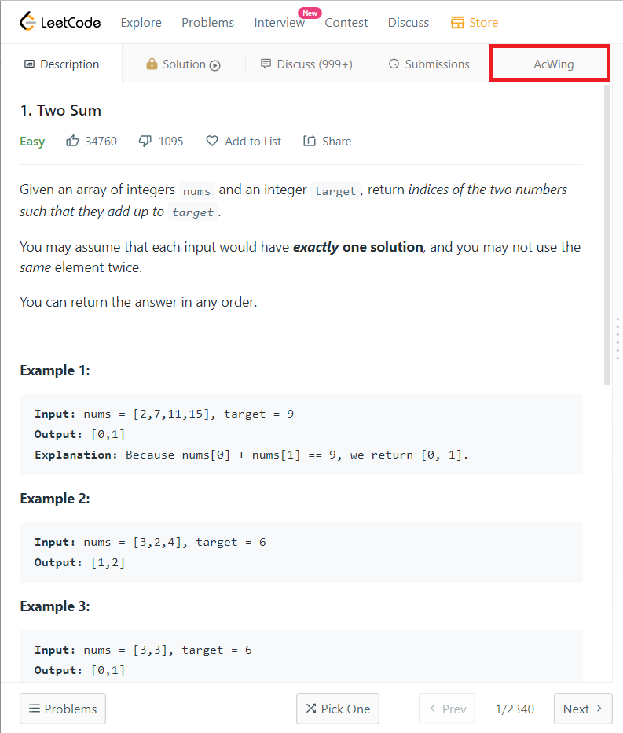
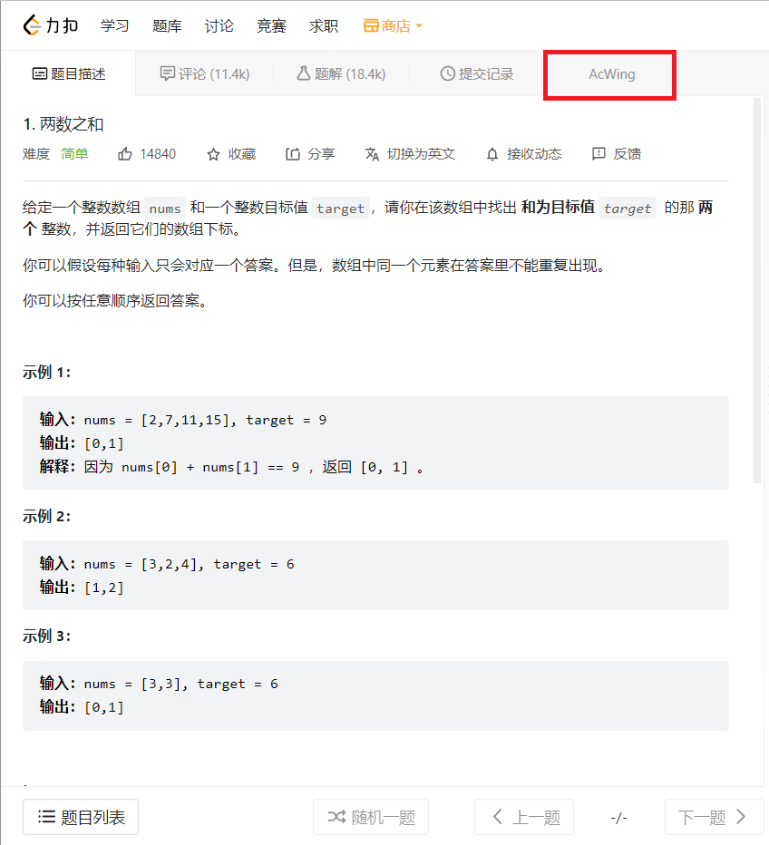

# leetcode2acwing

Este es un usuarioscript creado a partir de [@violentmonkey/generator-userscript](https://github.com/violentmonkey/generator-userscript).

## Página de publicación
https://greasyfork.org/en/scripts/447992-leetcode2acwing

## ¿Cómo se ve?
### Sitio de EE.UU.:

### Sitio de China:


## Desarrollo

```sh
$ yarn dev
```

## Construcción

```sh
$ yarn build
```

## Verificación de código

```sh
$ yarn lint
```
